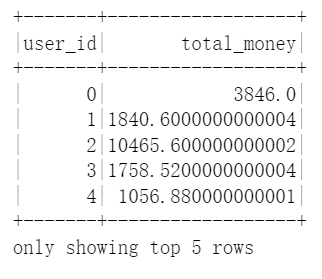
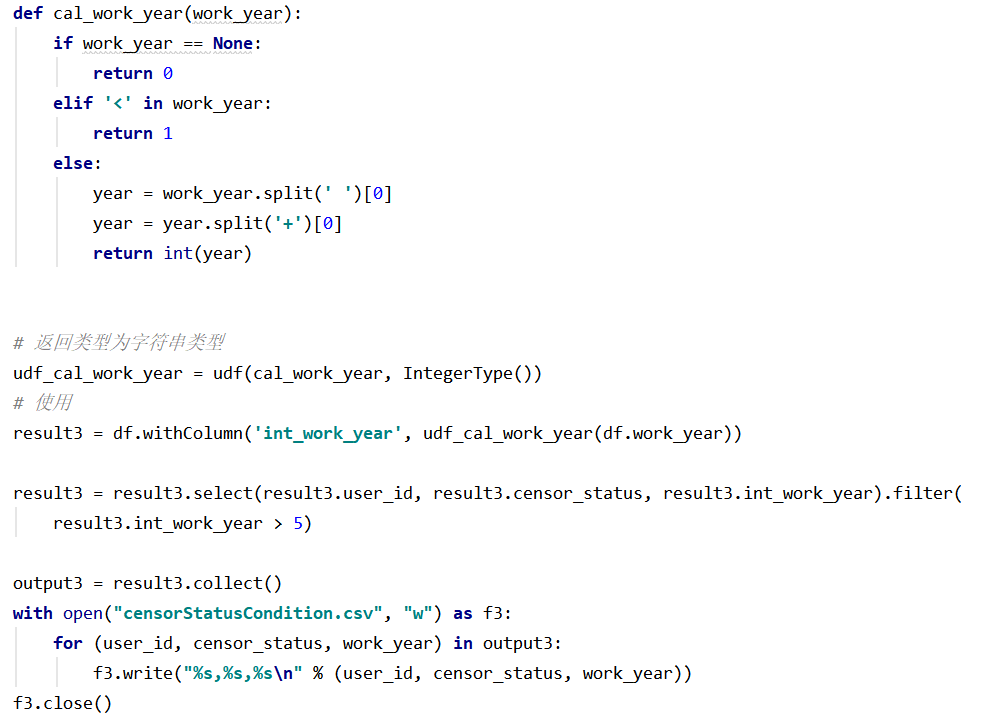
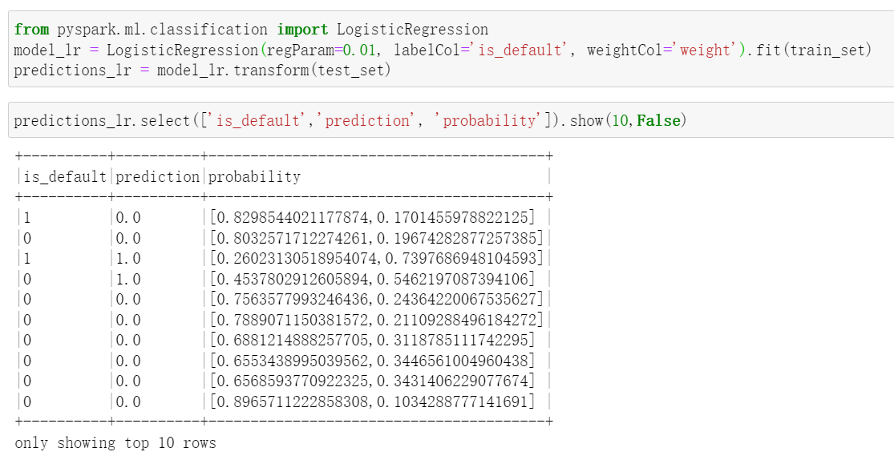

# <center>实验4 个贷违约预测</center>

<center>朱彤轩 191840376</center>

[TOC]

## 1 写在前面

### 1.1 环境

- 任务1在Windows下Intellij用Maven管理项目完成
- 任务2-3在bdkit上完成（后又在jupyter上重新执行便于展示）
- 任务4在windows下local模式spark，采用jupyter notebook编辑器
- mpr程序用java语言，spark程序都用python语言

### 1.2 文件结构


- **pic** 中放本文档中所有用到的图片
- **task1** 任务一相关文件
  - <u>output</u> 存放industry统计的结果
  - <u>src/main/java</u> 存放mapreduce代码
  - <u>pom.xml</u> maven依赖配置
- **task2** 任务二相关文件
  - <u>task2.ipynb</u> 任务二jupyter notebook
  - <u>TotalLoanDistribution.txt</u> total_loan分布统计文件
- **task3** 任务三相关文件
  - <u>task3.ipynb</u> 任务三jupyter notebook
  - <u>employerType.csv</u> 
  - <u>userTotalMoney.csv</u>
  - <u>censorStatusCondition.csv</u>
- **task4** 任务四相关文件
  - <u>task4.ipynb</u> 任务四jupyter notebook

## 2 任务一

> 目标：编写 MapReduce 程序，统计每个工作领域 industry 的网贷记录的数量，并按数量从大到小进行排序。

使用2个job，第一个任务用于统计industry出现的次数，第二个用于按数量从大到小进行排序。

**<u>job1：</u>**

**Mapper：**

将csv文本一行一行读取进来，对读进来的每一行做判断：

1. 如果偏移量是0，则说明是第一行（表头），故跳过，
2. 其余的为每一项数据，用`,`进行分割，找出代表industry的值

输出`<industry, 1>`。


**Reducer:**

对每一个`industry_value`出现次数进行求和，输出为`<industry, count>`


**<u>job1：</u>**

**Mapper：**

读取`<industry, count>`并倒置成`<count, industry>`。

**Reducer：**

在分发过程中重写比较函数使之从大到小按照出现频数排序并输出。


结果如下：


## 3 任务二

> 目标：编写 Spark 程序，统计网络信用贷产品记录数据中所有用户的贷款金额 total_loan 的分布情况。

将csv文本以text文本的形式一行一行读取进来，对读进来的每一行做判断：

1. 如果以loan_id开头则说明是表头，要跳过这一行；
2. 其余的为每一项数据，用`,`进行分割，找出代表total_loan的值；对total_loan除以1000，表留余数，形成`<total_loan//1000, 1>`的key-value对；然后reducer统计出现频率。


最后根据结果进行符合输出格式的输出：


部分结果：


## 4 任务三

### 4.1 统计 employer_type 数量分布

> 目标：统计所有用户所在公司类型 employer_type 的数量分布占比情况

1. 统计总共记录数字`total_num`；
2. 新建一列`employer_type_count`，全部赋值为1；
3. 按照`employer_type`进行groupby，对`employer_type_count`求和，及统计出每种员工的数量，存进`result1`；
4. 对`result1`每一项都除以总记录数，得到每种的占比；
5. 按照格式要求输出。


结果：


### 4.2 统计用户缴纳的利息金额

新建一列`total_money`，按照公式计算即可：


部分结果：



### 4.3 筛选工作年限超5年的员工

1. 由于`work_year`是字符串形式，所以设定函数`cal_work_year`将其转换为数值型。

   | 原始       | 转换后 |
   | ---------- | ------ |
   | None       | 0      |
   | 10+ years  | 11     |
   | 1-10 years | 本身   |
   | < 1 years  | 0      |

2. 用filter和select筛选出`<user_id,censor_status,int_work_year>`的数据。

部分结果：


## 5 任务四

### 5.1 数据处理

#### 5.1.1 数据读取

读取csv文件时令`inferSchema=True`，pyspark会根据读取到的数据形式推断数据的类型。然后再用printSchema查看每列的数据类型，看有无错误，经检查是没有错误的。


#### 5.1.2 处理缺失值

对于数值变量，缺失值填充为-1，对于字符串变量，缺失值填充为'-1'。注意pyspark对类型要求很严格，只会填充同类型的。

```python
df = df.na.fill(-1)
df = df.na.fill('-1')
```

#### 5.1.3 属性处理

(1) 本身为数值型数据的其他特征不做特殊处理。

(2) `loan_id`与`user_id`作为唯一标识符不参与预测模型。

(3) `class`, `sub_class`，将class中的字母A看作10，B看作20以此类推，与subclass的数字相加，合并为一个数字特征。

```python
def cal_sub_class(sub_class):
    if sub_class[0] == 'A':
        return 10 + int(sub_class[1])
    elif sub_class[0] == 'B':
        return 20 + int(sub_class[1])
    elif sub_class[0] == 'C':
        return 30 + int(sub_class[1])
    elif sub_class[0] == 'D':
        return 40 + int(sub_class[1])
    elif sub_class[0] == 'E':
        return 50 + int(sub_class[1])
    elif sub_class[0] == 'F':
        return 60 + int(sub_class[1])
    else:
        return 70 + int(sub_class[1])
    
udf_cal_sub_class = udf(cal_sub_class, IntegerType())
df = df.withColumn('int_sub_class', udf_cal_sub_class(df.sub_class))
```

(4) 对`work_year`，小于1年的记为0，大于10年的记录为11，其他的转换为准确年数。

```python
def cal_work_year(work_year):
    if work_year == '-1':
        return -1
    elif '<' in work_year:
        return 0
    elif '+' in work_year:
        return 11
    else:
        year = work_year.split(' ')[0]
        return int(year)

udf_cal_work_year = udf(cal_work_year, IntegerType())
df = df.withColumn('int_work_year', udf_cal_work_year(df.work_year))
```

(5) 对于`issue_date`和`earlies_credit_mon`这两个日期特征，转化为距离现在以年为单位的时间长度，如2015-06-01记录为6.5，表示距离现在6.5年了。


```python
udf_cal_issue_date = udf(cal_issue_date, FloatType())
udf_cal_earlies_credit_mon = udf(cal_earlies_credit_mon, FloatType())

df = df.withColumn('float_issue_date', udf_cal_issue_date(df.issue_date))
df = df.withColumn('float_earlies_credit_mon', udf_cal_earlies_credit_mon(df.earlies_credit_mon))
```

(6) 对`work_type`，`employer_type`，`industry`转化为数字特征进行处理。

运用StringIndexer对三个string类型的数据进行数字化处理，处理结果为`原名_index`，之后将原来的删去。


------

上述数据处理的部分结果如下：


### 5.2 生成训练集和测试集

运用`VectorAssembler`将所有有效的属性继承成`features`向量，然后随机按照8:2的比例将整体划分为训练集和测试集。


### 5.3 计算数据权重

因为数据集具有一定的不平衡性，仿照sklearn算class_weight的思路，为每个数据项赋予sample weight。


------

<font color='red'>**非常注意！**前期对属性的各种处理可以在划分训练集、测试集前一并进行，但是计算权重这件事情之能在训练集上进行，因为在模型训练出来之前，测试集是不能动的，前面的处理没有将训练集和测试集混起来，不然就有用label预测label的毛病。</font>

<font color='red'>更不能将权重weight作为一个属性，这样会出现很好看的结果，各种指标都是1，但这在逻辑上是不对的！</font>

### 5.4 模型训练与预测结果

#### 5.4.1 随机森林分类

模型训练与预测：


重要特征：


相关指标：

```
精确率: 0.4427646765943964
召回率: 0.8156424581005587
F1分数: 0.5739599835709676
准确率: 0.7585622132074217
auc: 0.8605717064923736
```

#### 5.4.2 SVM支持向量机

模型训练与预测：


相关指标：

```
精确率: 0.40208270579629074
召回率: 0.7791211540065038
F1分数: 0.530426884650318
准确率: 0.7249451353328457
auc: 0.8178927237891506
```

#### 5.4.3 逻辑回归

模型训练与预测：



相关指标：

```
精确率: 0.40543161978661496
召回率: 0.7667806220295172
F1分数: 0.5304109589041096
准确率: 0.7292844317350535
auc: 0.8153035546650128
```

## 6 遇到的问题及解决

### 6.1 bdkit python相关

在使用bdkit的时候发现StringIndexer貌似依赖numpy，而环境中是没有的。经测试，发现：

(1) bdkit的console中是python2，submit到pyspark中是python3. 


(2) pip install显示没有pip这个命令，说明pip与python分开的，用命令`python -m pip install --upgrade pip`安装pip

(3) 在console里pip install numpy的时候需要用`pip3`不然安装到python2的环境中去了

### 6.2 类型转换


执行对`earlies_credit_mon`的处理操作之后，在打印前20个数的时候发现第2个、第15个和第17个是null。在python中用pandas dataframe的apply试过之后发现没有问题。观察这3个数的共性，发现相比其他的数字有小数，这3个数字其实是整数。

而在前面函数输出类型的时候，我给的是float类型。所以在函数的返回值那里显式将结果返回为float类型，这样一来就解决了数值“莫名其妙”变null的问题。


## 7 致谢

感谢施宇同学在我转换变成环境配置上提供的教程；

感谢邵路婷同学给我在啥也不懂的状态下引路，同时我们一起探讨了为什么会出现accuracy 100%，F1 100%的不正常情况。